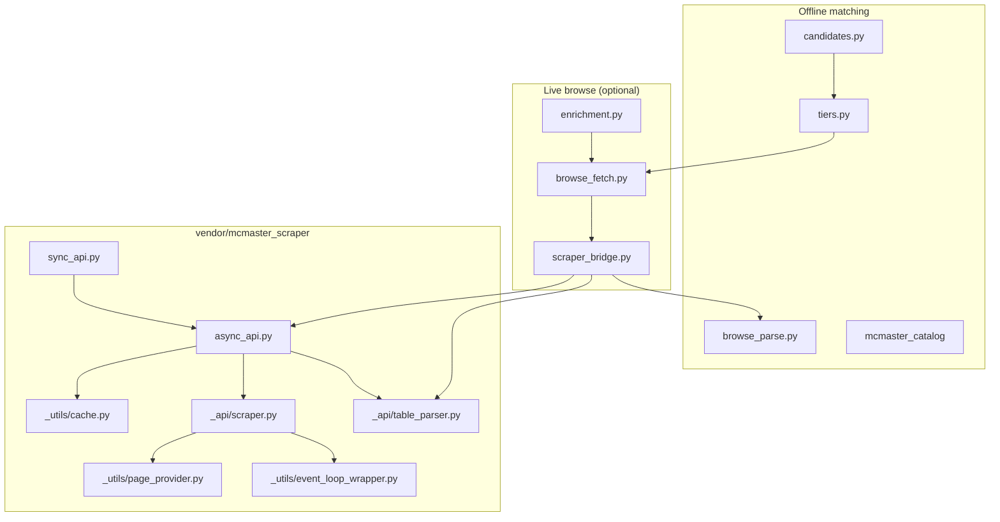
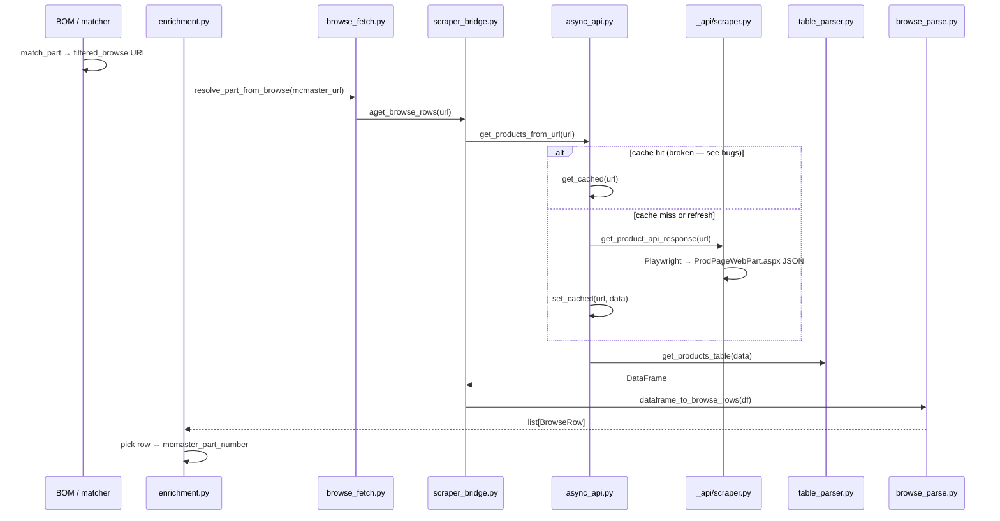
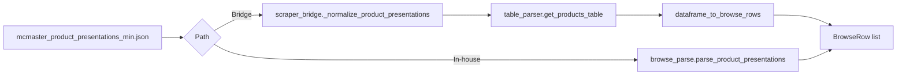
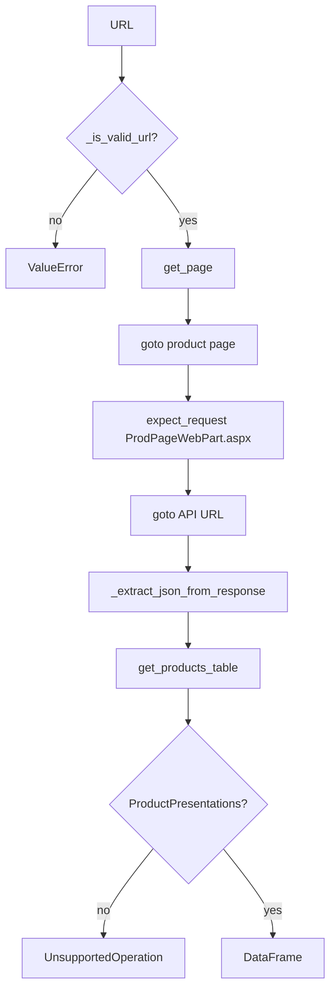
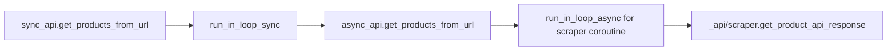

# McMaster vendor scraper — analysis

Technical reference for the vendored [mcmaster-scraper](https://github.com/thedjchi/mcmaster-scraper) package at `vendor/mcmaster_scraper/` and its integration with `backend/services/vendors/mcmaster/`.

| Field | Value |
|-------|-------|
| Upstream version | `0.2.1` (`vendor/mcmaster_scraper/VERSION`) |
| Upstream commit | `7249d98049588d9e792c9a71dadea8c1e27727a7` |
| Install | `pip install -e '.[playwright]' && playwright install chromium` |
| Wheel package | `vendor/mcmaster_scraper/mcmaster_scraper` (see `pyproject.toml`) |

Related docs: [McMaster vendor adapter](../backend/mcmaster.md), [Vendor adapters](../backend/vendors.md), [Vendor notebook](../../notebooks/vendor/01_mcmaster_scraper.ipynb).

---

## Package layout — `vendor/mcmaster_scraper/mcmaster_scraper/`

Nine Python modules ship under the package root (no subpackages beyond `_api/` and `_utils/`).

```
vendor/mcmaster_scraper/mcmaster_scraper/
├── __init__.py                 # Package docstring only (# TODO write tests upstream)
├── sync_api.py                 # Public sync entry: get_products_from_url(s)
├── async_api.py                # Public async entry + disk cache orchestration
├── _api/
│   ├── scraper.py              # Playwright: discover ProdPageWebPart.aspx, fetch JSON
│   ├── table_parser.py         # ProductPresentations JSON → pandas DataFrame
│   └── _text_parser.py         # Cell/header text extraction + numeric parsing
└── _utils/
    ├── cache.py                # diskcache LRU persistence (user cache dir)
    ├── page_provider.py        # Singleton Playwright browser context + stealth
    └── event_loop_wrapper.py   # Background thread event loop for sync/async bridge
```

Adjacent (not under `mcmaster_scraper/`):

| Path | Role |
|------|------|
| `vendor/mcmaster_scraper/docs/example.py` | Upstream usage sample (wrapped by `scripts/mcmaster_scraper_example.py`) |
| `vendor/mcmaster_scraper/README.md` | Vendoring notes and update procedure |

---

## File map (all package modules)

### `__init__.py`

- **Purpose:** Package marker; docstring includes upstream README via Sphinx-style include (not used at runtime).
- **Exports:** None (`sync_api` / `async_api` are imported explicitly by callers).
- **Dependencies:** None.
- **Notes:** Upstream comment `# TODO write tests` — no tests target this file directly.

### `sync_api.py`

- **Purpose:** Synchronous public API for notebook/script callers.
- **Functions:**
  - `get_products_from_url(url, refresh=False) -> DataFrame`
  - `get_products_from_urls(urls, refresh=False) -> list[DataFrame]`
- **Flow:** Delegates to `async_api` via `run_in_loop_sync()`.
- **Raises:** `ValueError` (invalid URL), `UnsupportedOperation` (no product table on page).

### `async_api.py`

- **Purpose:** Async public API; owns cache read/write around network fetch.
- **Functions:**
  - `get_products_from_url(url, refresh=False) -> DataFrame`
  - `get_products_from_urls(urls, refresh=False) -> list[DataFrame]` (parallel via `asyncio.gather`)
- **Flow:**
  1. `get_cached(url)` — on hit and `refresh=False`, skip network.
  2. Else `run_in_loop_async(get_product_api_response(url))` then `set_cached(url, data)`.
  3. `get_products_table(data)` → `DataFrame`.
- **Integration point:** Called by `scraper_bridge.aget_products_dataframe()`.

### `_api/scraper.py`

- **Purpose:** Live discovery of McMaster's internal product-table API.
- **Functions:**
  - `get_product_api_response(url) -> dict` — main async fetch
  - `_extract_json_from_response(res) -> dict` — strip JSON from response body text
  - `_is_valid_url(url) -> bool` — regex gate for `mcmaster.com` URLs
- **Mechanism:**
  1. `get_page()` → new Playwright page (stealth Chromium).
  2. `page.goto(url, wait_until="commit")`.
  3. `page.expect_request("**/ProdPageWebPart.aspx**")` — capture XHR URL.
  4. Navigate to API URL; read `body` text; parse JSON substring.
  5. Close page.
- **Design note:** Direct navigation to the API URL avoids Playwright response-cache eviction on large JSON payloads.

### `_api/table_parser.py`

- **Purpose:** Walk `ProductPresentations` node in API JSON; build unified `DataFrame`.
- **Functions:**
  - `get_products_table(json) -> DataFrame` — public
  - `_find_pivot_tables(root) -> dict[tuple[str, str|None], dict]`
  - `_parse_pivot_table(table) -> DataFrame`
- **Behavior:**
  - Finds node where `Name == "ProductPresentations"`.
  - One table per product/subtype pair; merges with optional `Product Type` / `Product Subtype` columns when multiple distinct values exist.
  - Uses `PrimaryProductGroup.ColumnIds` when present; falls back to all `ColumnIds`.
- **Raises:** `UnsupportedOperation` if no `ProductPresentations` found.

### `_api/_text_parser.py`

- **Purpose:** Map McMaster metadata IDs to human-readable header/cell strings.
- **Functions:**
  - `get_header_text(col_id, meta) -> str` — maps `PART_NUMBER` → `"Part Number"`, `PRICING` → `"Price"`.
  - `get_cell_text(cell_id, meta) -> str | float`
  - `_extract_text(meta_item) -> str | float`
  - `_parse_number(text) -> str | float` — float, fractional inches (`1 1/2`), or raw text.
- **Limitation:** `# TODO parse units and normalize imperial vs metric based on pref` (upstream).

### `_utils/cache.py`

- **Purpose:** Persist raw API JSON (`dict`) between runs via `diskcache`.
- **Storage:** `platformdirs.user_cache_dir("mcmaster-scraper")`, LRU eviction.
- **Functions:**
  - `get_cached(url) -> dict | None` — lookup key = `md5(url.encode()).hexdigest()`
  - `set_cached(key, value) -> None` — **stores under raw `key` argument** (see Known bugs)

### `_utils/page_provider.py`

- **Purpose:** Lazy singleton Chromium browser context with `playwright-stealth`.
- **Functions:**
  - `get_page() -> Page` — new tab in shared context
  - `_ensure_browser_context() -> BrowserContext` — locked lazy init
- **Globals:** `_browser_context`, `_lock` (asyncio).
- **Note:** Browser/context are never explicitly shut down (process-lifetime singleton).

### `_utils/event_loop_wrapper.py`

- **Purpose:** Run Playwright coroutines from sync code and nest async calls without blocking the caller's loop incorrectly.
- **Functions:**
  - `run_in_loop_sync(coro) -> T`
  - `run_in_loop_async(coro) -> T`
  - `_ensure_loop() -> AbstractEventLoop` — daemon thread + `run_forever()`
- **Platform:** `ProactorEventLoop` on Windows, `SelectorEventLoop` elsewhere.

---

## Integration with `backend/services/vendors/mcmaster/`

The repo treats the vendored package as an **optional live enrichment** path. Offline matching (catalog, filters, search URLs) does not import Playwright.

### Bridge layer — `scraper_bridge.py`

Central adapter between vendored APIs and repo types:

| Function | Vendored call | Output |
|----------|---------------|--------|
| `get_products_dataframe(url, refresh=)` | `sync_api.get_products_from_url` | `pandas.DataFrame` |
| `aget_products_dataframe(url, refresh=)` | `async_api.get_products_from_url` | `pandas.DataFrame` |
| `aget_browse_rows(url, refresh=)` | above + `browse_parse.dataframe_to_browse_rows` | `list[BrowseRow]` |
| `get_products_table_from_json(payload)` | `_api.table_parser.get_products_table` after `_normalize_product_presentations` | `pandas.DataFrame` |

**Key repo-only logic in the bridge:** `_normalize_product_presentations()` coerces string JSON keys (from `json.loads` on fixtures) to `int` keys expected by upstream `table_parser` and `_text_parser`. Live API responses already use numeric keys.

`_require_scraper()` raises a actionable `RuntimeError` if `mcmaster_scraper` is not importable (missing `[playwright]` extra).

### Live fetch gate — `browse_fetch.py`

```
fetch_browse_rows(url)
  → is_mcmaster_url(url)
  → MCMASTER_BROWSE_RESOLVE_ENABLED must be 1
  → scraper_bridge.aget_browse_rows(url)
```

`resolve_part_from_browse()` fetches rows and picks by `part_number_hint` or sole row.

### Enrichment — `enrichment.py`

Pipeline hook after offline matching:

```
enrich_parts(parts)
  for each part:
    try_resolve_part_from_browse(part)   # filtered_browse tier + browse enabled
    enrich_part_with_api(part)           # optional B2B API (separate from scraper)
```

Browse resolution only runs when `part.match_tier == "filtered_browse"`, no part number yet, and `part.mcmaster_url` is set.

### Dual parsers — `browse_parse.py`

In-house `parse_product_presentations()` mirrors vendored `table_parser` logic but:

- Works with string-keyed fixture JSON natively (no normalization step).
- Emits `BrowseRow` directly instead of `DataFrame`.

Tests assert **parser parity** on `tests/fixtures/mcmaster_product_presentations_min.json`.

### Cross-test harness — `cross_test.py`

Regression catalog: `data/mcmaster_regression_urls.json`.

- **Offline:** matcher vs pipeline URL parity + fixture parser agreement.
- **Live:** `fetch_browse_rows` vs `aget_browse_rows` part-number set equality.

### Module dependency graph (repo ↔ vendor)



---

## Data flow diagrams

### End-to-end: BOM line → live part number (browse resolve enabled)



### Offline: fixture JSON → `BrowseRow` (no network)



### Vendored internal: single URL fetch



### Sync vs async entry points



---

## Known bugs and limitations

### 1. Cache key mismatch (`_utils/cache.py`) — **confirmed**

`get_cached` and `set_cached` use **different key schemes**:

```python
# get_cached — hashes the URL
key = hashlib.md5(url.encode()).hexdigest()
if key in cache:
    return cache[key]

# set_cached — stores under the first argument verbatim
def set_cached(key: str, value: Any) -> None:
    cache[key] = value
```

`async_api.py` calls:

```python
cached = get_cached(url)          # reads md5(url)
set_cached(url, data)             # writes raw url string
```

**Impact:** Cache writes never satisfy cache reads. Every request hits Playwright/network unless upstream is fixed. The `refresh=False` default provides **no performance benefit** today.

**Fix (upstream or local patch):** Make `set_cached` hash the URL the same way as `get_cached`, e.g.:

```python
def set_cached(url: str, value: Any) -> None:
    key = hashlib.md5(url.encode()).hexdigest()
    cache[key] = value
```

### 2. JSON key type mismatch (mitigated in repo)

Upstream `table_parser` / `_text_parser` index metadata dicts with **integer** IDs. Fixture files and some saved JSON use **string** keys. The bridge's `_normalize_product_presentations()` fixes this for offline paths; live API responses typically work without normalization.

### 3. No browser teardown

`page_provider.py` keeps a process-global browser context. Long-running API workers may accumulate memory; pages are closed per fetch but the browser persists.

### 4. Upstream test debt

`__init__.py` notes `# TODO write tests`. This repo adds integration/fixture tests but does not unit-test vendored internals in isolation.

### 5. Terms of use / CI

Live scraping should stay behind `MCMASTER_BROWSE_RESOLVE_ENABLED=1`. Default CI runs offline tests only (`@pytest.mark.integration` for live cases).

---

## Test coverage matrix

Legend: ✅ covered · ⚠️ partial / indirect · ❌ not covered · 🔒 integration-only (network + Playwright)

| Module | Unit | Fixture / offline | Integration | Notes |
|--------|------|-------------------|-------------|-------|
| `__init__.py` | ⚠️ | — | — | Import smoke in `test_mcmaster_scraper_package_is_vendored` |
| `sync_api.py` | ❌ | ⚠️ | 🔒 | Exercised live via `scripts/mcmaster_scraper_example.py`; no pytest |
| `async_api.py` | ❌ | ⚠️ | 🔒 | Via `scraper_bridge.aget_*` in live cross-test |
| `_api/scraper.py` | ❌ | ❌ | 🔒 | Playwright-only; `run_live_case` |
| `_api/table_parser.py` | ⚠️ | ✅ | — | `get_products_table_from_json` + parser parity tests |
| `_api/_text_parser.py` | ⚠️ | ✅ | — | Indirect via table_parser fixture |
| `_utils/cache.py` | ❌ | ❌ | ❌ | **Bug untested** — no test asserts cache hit |
| `_utils/page_provider.py` | ❌ | ❌ | 🔒 | Implicit in live fetch |
| `_utils/event_loop_wrapper.py` | ❌ | ⚠️ | 🔒 | Used whenever sync_api / nested async runs |
| **Bridge** `scraper_bridge.py` | ⚠️ | ✅ | 🔒 | `test_mcmaster_scraper_vendored.py`, cross_test |
| **Fetch** `browse_fetch.py` | ✅ | — | 🔒 | Gate test: disabled by default |
| **Parse** `browse_parse.py` | ✅ | ✅ | — | `test_mcmaster_vendor.py`, vendored parity |
| **Enrichment** `enrichment.py` | ❌ | ❌ | 🔒 | Browse resolve path not unit-tested |
| **Cross-test** `cross_test.py` | ✅ | ✅ | 🔒 | `test_mcmaster_cross_test.py` |

### Test files referencing vendor / bridge

| Test file | Scope |
|-----------|-------|
| `tests/test_mcmaster_scraper_vendored.py` | Bridge JSON parse, DataFrame → BrowseRow, package vendored path, browse gate |
| `tests/test_mcmaster_vendor.py` | In-house browse_parse, filters, API payload (not scraper network) |
| `tests/test_mcmaster_cross_test.py` | Offline regression catalog; optional live browse |
| `tests/test_mcmaster_handler.py` | Category routing (indirect tier → browse URL) |
| `tests/test_mcmaster_catalog.py` | Catalog lookup (upstream of browse URLs) |

### Coverage gaps (priority)

1. **Cache round-trip** — would catch md5/url mismatch.
2. **`_is_valid_url` edge cases** — www vs non-www, trailing slashes.
3. **`_extract_json_from_response`** — malformed body, empty body.
4. **Multi-table pages** — multiple `ProductPresentations` subtypes.
5. **`enrichment.try_resolve_part_from_browse`** — mock `fetch_browse_rows`.
6. **Sync/async parity** — same URL via `sync_api` vs `async_api` on fixture-backed mock.

---

## Configuration flags

| Variable | Default | Effect on scraper path |
|----------|---------|------------------------|
| `MCMASTER_BROWSE_RESOLVE_ENABLED` | `0` | Must be `1` for `browse_fetch.fetch_browse_rows` |
| `MCMASTER_FILTERED_BROWSE_ENABLED` | (see config) | Enables tier-4 filtered browse URLs offline |
| `MCMASTER_API_ENABLED` | `0` | Separate B2B API enrichment; not used by vendored scraper |

---

## Operational entry points

| Entry | Path |
|-------|------|
| Example script | `scripts/mcmaster_scraper_example.py` (`--offline` for fixture) |
| Notebook | `notebooks/vendor/01_mcmaster_scraper.ipynb` |
| Cross-test CLI | `scripts/mcmaster_cross_test.py` (if present) |
| Pytest offline | `pytest tests/test_mcmaster_scraper_vendored.py tests/test_mcmaster_cross_test.py -m 'not integration'` |
| Pytest live | `MCMASTER_BROWSE_RESOLVE_ENABLED=1 pytest -m integration` |

---

## Updating from upstream

See `vendor/mcmaster_scraper/README.md`. After copying upstream `src/mcmaster_scraper/`:

1. Re-record `VERSION` and `UPSTREAM_COMMIT`.
2. Re-run offline parser parity tests.
3. Re-check cache bug — may be fixed upstream; adjust Known bugs section if so.
4. Optionally run one live cross-test case with browse enabled.
