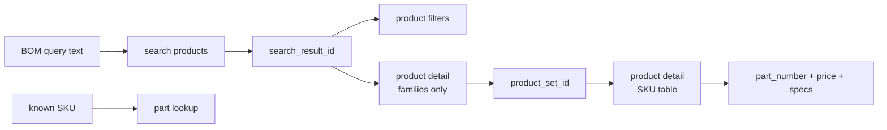

# McMaster-Carr vendor adapter

McMaster linking uses **six offline tiers** plus two **optional live** enrichment paths. This document is the reference implementation for other supplier adapters — see [Vendor adapters](vendors.md).

## Tier order (offline)

| Tier | `match_tier` | When | Confidence hint |
|------|--------------|------|-----------------|
| 1 | `catalog` | Phrase hit in `data/mcmaster_catalog.json` | 1.0 |
| 2 | `rule` | `mcmaster_catalog.py` rules (M3 length table, bearing trade #) | 1.0 |
| 3 | `part_number` | SKU embedded in BOM text (`91290A120`) | 0.95 |
| 4 | `filtered_browse` | Metric fastener with category + browse root | 0.75 |
| 5 | `category_search` | Category route + `?searchQuery=` | 0.55 |
| — | `not_applicable` | No category match, non-hardware, or instruction line | — |

**Standard Components excluded:** McMaster's `/products/standard-components/` category is for calibration masters, gauge blocks, and metrology — not BOM fasteners or general hardware. Unmatched queries return `not_applicable` with no URL instead of a site-wide search there.

Resolver entry point: `backend/services/vendors/mcmaster/tiers.py` → `resolve_mcmaster_link()`.

Legacy bridge: `mcmaster_handler.build_mcmaster_link()` delegates to the resolver.

## URL patterns

### Product (catalog / part number)

```
https://www.mcmaster.com/{partNumber}/?searchQuery={encodedQuery}
```

Built by `vendors/mcmaster/urls.py` → `mcmaster_product_url()`.

### Category search

```
https://www.mcmaster.com/products/screws/?searchQuery=M5+hex+bolt
```

Routes from `data/mcmaster_categories.json` via `classify_category()`.

### Filtered browse (live-site inspired)

McMaster encodes facets as **path segments**, not query parameters. The facet naming (`system-of-measurement~metric`, `thread-size~m3`, …) matches the public catalog filter model — see [Public catalog navigation](#public-catalog-navigation) below.

```
{categoryBrowseRoot}{facet~value/}…
```

**Example — M3 × 16 mm steel socket head cap screw (no catalog hit):**

```
https://www.mcmaster.com/products/screws/socket-head-screws-2~/steel-socket-head-screws~~/
  system-of-measurement~metric/
  thread-size~m3/
  length~16-mm/
  ?searchQuery=M3x16+socket+head+cap+screw
```

| BOM signal | Facet segment | Slug helper |
|------------|---------------|---------------|
| Metric | `system-of-measurement~metric/` | always for metric fasteners |
| M3 | `thread-size~m3/` | `metric_thread_filter_slug()` — M2.5 → `m2-5` |
| 16 mm length | `length~16-mm/` | `metric_length_filter_slug()` |

Browse roots (material finishes) live in `data/mcmaster_browse_roots.json`. When the BOM does not name a finish, the matcher attaches all applicable finish browse URLs on `Part.browse_finish_options` (black oxide, zinc plated, 18-8 stainless). When the BOM names a finish (`stainless`, `zinc plated`, `black oxide`, `alloy steel`), only that finish is offered.

Filter builders: `vendors/mcmaster/filters.py`, finish options: `vendors/mcmaster/finish_browse.py`.

## Official Product Information API (B2B)

Docs: [McMaster-Carr Product Information API](https://www.mcmaster.com/help/api/)

| Endpoint | Method | Use in this repo |
|----------|--------|------------------|
| `/v1/login` | POST | Bearer token (client cert required) |
| `/v1/products` | PUT | Subscribe + return product JSON |
| `/v1/products/{partNumber}` | GET | Specs, status, links |
| `/v1/products/{partNumber}/price` | GET | Price breaks |

Client: `backend/services/vendors/mcmaster/api.py` (re-exported from `mcmaster_api.py`).

**Important constraints from McMaster:**

- Requires approved account + PFX certificate (`eprocurement@mcmaster.com`).
- Must **subscribe** to each part (PUT) before GET — daily/total subscription limits apply.
- Tokens expire after 24h or logout.

When `MCMASTER_API_ENABLED=1`, the import pipeline calls `enrich_part_with_api()` after matching to fill:

- `mcmaster_detail_description`
- `mcmaster_product_status` (`Active`, `Discontinued`, …)
- `match_tier` → `api_verified`

API responses are **never** returned to the browser; guardrail tests scan for credential leaks.

### Mapping API specs to verification

API `Specifications[]` with `Attribute` / `Values` mirrors product `specs` on the public catalog detail table. Future work: cross-check `hardware_spec.py` extractions against API attributes (Thread Size, Length, System of Measurement).

## Public catalog navigation

McMaster-Carr does **not** publish a public developer API for catalog search. The website itself follows a predictable multi-step flow — search → category tiles → filters → product families → SKU rows — that third-party wrappers and our offline matcher both approximate. This repo does **not** call any hosted catalog proxy; we document the flow because it names the navigation IDs, facet shapes, and call order the live site uses — useful when debugging browse URLs or extending filtered browse.

### Site flow steps

| Step | Purpose | Key inputs | Key outputs |
|------|---------|------------|-------------|
| Search suggest | Type-ahead / term discovery | query text, result count | Ranked suggestions with optional part-number flag |
| Search products | Free-text → category tiles | query text | `search_result_id`, category tiles with `product_outline_entry_id` or `product_family_id` |
| Product filters | Facet options for a category | `search_result_id`, optional category/family IDs | Filter names (System of Measurement, Thread Size, Length, Material, …) and value IDs with product counts |
| Product detail | Families or SKU rows | `search_result_id`, `product_outline_entry_id`; optional `product_set_id` | Without family ID: product family list. With family ID: part numbers, prices, spec objects |
| Part lookup | Validate a SKU | part number | found/discontinued status, catalog page, parent family, product URL |

### Typical call chain



1. **Search products** — map a phrase like `M3 socket head cap screw` to category tiles; retain `search_result_id` and a `product_outline_entry_id`.
2. **Product filters** — list facets with value IDs and counts — same attributes we encode as path segments in `filters.py`.
3. **Product detail** (families only) — list product families inside the category.
4. **Product detail** (with `product_set_id`) — return table rows: part numbers, prices, spec objects.
5. **Part lookup** — confirm a pasted SKU exists and is current (closest the public site offers to availability).

Search suggest is optional — ranked autocomplete for UI search boxes, not needed for BOM line matching.

### Mapping site flow → this repo

| Site step / field | Our equivalent | Module / data |
|-------------------|----------------|---------------|
| Search → category tile | `classify_category()` + category route | `mcmaster_categories.json`, `category_router.py` |
| Filter facet names/values | Path segments `facet~value/` | `filters.py`, `finish_browse.py` |
| `product_outline_entry_id` / browse root | `browse_roots` URL prefix | `mcmaster_browse_roots.json` |
| Product detail table | `ProductPresentations` JSON | `browse_parse.py`, `browse_scrape.py` |
| Part lookup / catalog status | Tier 3 SKU extract + optional API enrich | `part_numbers.py`, `api.py`, `enrichment.py` |
| `search_result_id` threading | Not stored — we build static filtered URLs offline | `tiers.py` tier 4 |
| Hosted catalog HTTP | Not used | — |

When tier 4 (`filtered_browse`) fires, we skip the search step and jump straight to a **pre-built filtered browse URL** derived from BOM specs. Optional live browse (`MCMASTER_BROWSE_RESOLVE_ENABLED`) then loads the same `ProductPresentations` JSON the site uses server-side.

### Public site vs official API vs our defaults

| | Public catalog (browser) | Official Product Information API | This repo (default) |
|---|--------------------------|----------------------------------|---------------------|
| **Auth** | None (session cookies) | Client cert + B2B account | None |
| **Search / categories** | Site search UI | Subscribe per part only | Curated `mcmaster_catalog.json` + rules |
| **Filters** | Category facet picker | Specs on subscribed parts | Offline facet paths in URLs |
| **SKU + price** | Product detail table | `GET /products/{partNumber}/price` | Browse resolve or catalog hit |
| **Part validation** | Part-number lookup page | `GET /products/{partNumber}` | Regex tier 3 + optional API |
| **Stock / availability** | Discontinued flag only | Product status field | `mcmaster_product_status` when API enabled |
| **Rate limits** | Site / polite scraping | McMaster subscription caps | `RATE_LIMIT_OUTBOUND_MIN_INTERVAL` |
| **CI / offline** | Requires network | Requires credentials | Fully offline tiers |

Common integration patterns this flow supports: filterable part pickers (facet APIs), BOM SKU validation (part lookup), and price monitoring (fixed product family). Our curated catalog + filtered browse URLs cover the same user-facing goal without live navigation on every import.

### Validating offline data against the live site

Use optional browse resolve (`MCMASTER_BROWSE_RESOLVE_ENABLED=1`), `scripts/mcmaster_browse_example.py`, or the monthly taxonomy crawl to confirm `mcmaster_categories.json` routes and browse-root slugs still match McMaster's public navigation before committing offline data changes.

## Browse table resolution (optional live)

In-house Playwright scrape + parser (logic migrated from upstream [mcmaster-scraper](https://github.com/thedjchi/mcmaster-scraper) v0.2.1 — archived at `docs/archive/mcmaster-scraper-v0.2.1/`):

1. Load filtered browse URL with Playwright (`browse_scrape.fetch_product_presentations`).
2. Intercept `ProdPageWebPart.aspx` XHR (same endpoint the site uses for product tables).
3. Parse `ProductPresentations` JSON → `BrowseRow` list (`browse_parse.parse_product_presentations`).

| Module | Role |
|--------|------|
| `browse_scrape.py` | Playwright ProdPageWebPart JSON discovery |
| `browse_fetch.py` | Live fetch gate (`MCMASTER_BROWSE_RESOLVE_ENABLED=1`) |
| `browse_parse.py` | JSON → `BrowseRow` (fixtures + live path) |
| `scripts/mcmaster_browse_example.py` | Offline fixture / live browse demo |
| `notebooks/mcmaster_browse.ipynb` | Notebook walkthrough |
| `tests/fixtures/mcmaster_product_presentations_min.json` | Golden parse fixture |

Install: `pip install -e '.[playwright]' && playwright install chromium`

When browse resolve succeeds, `mcmaster_part_number` is filled from the table and confidence ≈ 0.9.

**Terms of use:** McMaster limits automated load to what is needed for purchasing decisions. Keep `RATE_LIMIT_OUTBOUND_MIN_INTERVAL`, disable browse in CI, and use curated catalog + offline filters by default. **Monthly taxonomy crawl** uses a separate polite batch job — see [McMaster taxonomy](mcmaster-taxonomy.md). Security considerations for outbound URLs: [Security](../security.md).

## Part number extraction

`vendors/mcmaster/part_numbers.py`:

- Regex: `\b[0-9]{4,5}[A-Z][0-9]{2,3}\b`
- Used in tier 3 when makers paste SKUs in description/spec fields

## Data files

| File | Purpose |
|------|---------|
| `data/mcmaster_catalog.json` | Curated phrase → SKU |
| `data/mcmaster_categories.json` | Category routes + signals |
| `data/mcmaster_metacategories.json` | 26 nav departments + product slug → department |
| `data/mcmaster_category_routing.json` | Parent/escape routing weights |
| `data/mcmaster_browse_roots.json` | Material-specific browse roots for filters |
| `data/mcmaster_site_taxonomy.json` | Monthly-crawled product-family tiles (Fastening & Joining) |

Taxonomy crawl schedule, field reference, and workflow:
[McMaster taxonomy](mcmaster-taxonomy.md).

Integrity: `scripts/check_catalog_integrity.py` (keys/titles vs rules).
Coverage: `pytest tests/test_category_coverage.py -m "not integration"`.

## Matcher fields

After `match_part()`:

| Field | Set when |
|-------|----------|
| `mcmaster_url` | Always (unless `not_applicable`) |
| `mcmaster_part_number` | Catalog, rule, part_number, or browse resolve |
| `match_tier` | Winning offline/live tier |
| `hardware_match_status` | Post-match size/length verification |
| `mcmaster_detail_description` | API enrich |
| `mcmaster_product_status` | API enrich |

## Notebook / API parity

| Context | Offline tiers | API enrich | Browse resolve |
|---------|---------------|------------|----------------|
| `match_parts_only()` | Yes | No | No |
| `import_from_url` / `import_from_file` | Yes | If `MCMASTER_API_ENABLED` | If `MCMASTER_BROWSE_RESOLVE_ENABLED` |
| `04_match_mcmaster.ipynb` | Yes | No | No |

## Compare: McMaster data sources

| Approach | Auth | Best for | This repo |
|----------|------|----------|-----------|
| **Curated catalog + rules** | None | MVP, CI, predictable matching | **Default** — `tiers.py` tiers 1–5 |
| **Public browse JSON** | None (browser session) | Discovering SKUs from filters | Optional `browse_fetch.py` |
| **Official API** | Client cert + account | Production ERP, prices, CAD links | Optional `api.py` |

We reimplemented the site's **filter URL grammar** and **product table JSON shape** in-house so the template stays self-contained and CI stays offline. When McMaster's public UI changes, compare live browse output against `browse_parse.py` fixtures and the monthly taxonomy crawl — see [Public catalog navigation](#public-catalog-navigation).

## Module map

```
vendors/mcmaster/
├── urls.py           # mcmaster_product_url, filtered_browse_url
├── filters.py        # facet path segments
├── browse_roots.py   # load data/mcmaster_browse_roots.json
├── part_numbers.py   # SKU extraction
├── tiers.py          # resolve_mcmaster_link
├── browse_parse.py   # ProductPresentations → BrowseRow
├── browse_scrape.py  # Playwright ProdPageWebPart JSON fetch
├── browse_fetch.py   # Live fetch gate (MCMASTER_BROWSE_RESOLVE_ENABLED)
├── api.py            # Official REST client
└── enrichment.py     # pipeline post-match hook
```

Shims (stable imports): `mcmaster_catalog.py`, `mcmaster_handler.py`, `mcmaster_api.py`, `matcher.py`.
